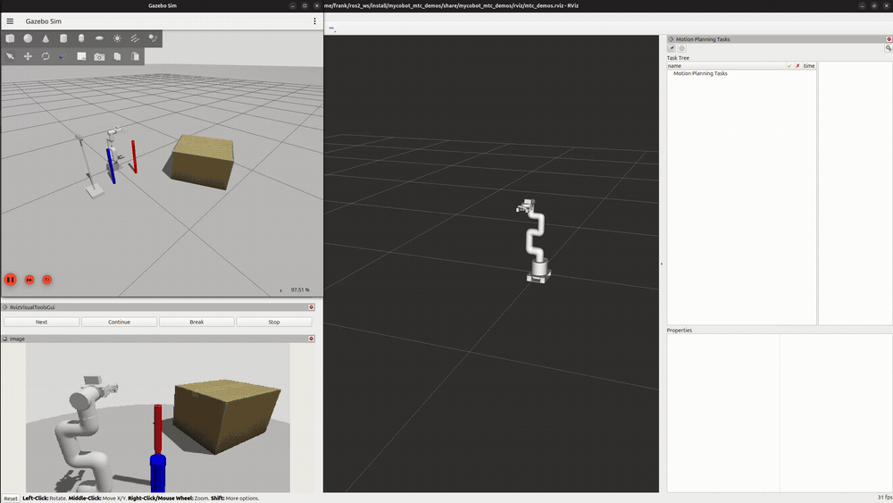

# myCobot Perception-Based Pick and Place with MoveIt 2 Task Constructor

A ROS 2 (Jazzy) project implementing **camera-driven pick-and-place manipulation** on the myCobot 280 (Elephant Robotics, 6-DOF) using the MoveIt Task Constructor (MTC) framework. A point-cloud perception service detects an object's shape, pose, and dimensions from a simulated RGB-D camera and hands it to MoveIt 2 as a live collision object.

## Demo



The clip starts with the OMPL/RRTConnect planner searching for a valid task solution — the arm briefly flickers through several candidate configurations in RViz as the planner evaluates and discards options (this is planning visualization, not robot motion). Once a solution is found, the robot executes it for real, at a reduced 30% velocity/acceleration scaling for clarity: approach → grasp → lift → transport → place → retreat.

---

## Project Overview

The system implements a full perception-to-manipulation pipeline. A **perception service node** processes a live RGB-D point cloud — segmenting the support surface, clustering the remaining points, and fitting primitive shapes (cylinder/box) to each cluster — and returns the best-matching detected object as a MoveIt 2 collision object. A **MoveIt Task Constructor node** consumes that detection and plans/executes a full multi-stage pick-and-place task.

Key behaviors demonstrated:

- RGB-D point cloud segmentation and clustering for object detection (PCL: RANSAC plane segmentation, Euclidean cluster extraction, shape fitting)
- A custom ROS 2 service (`GetPlanningScene`) bridging perception output into MoveIt 2's planning scene
- Multi-stage task planning with MoveIt Task Constructor: approach, grasp-pose generation and scoring, attach, lift, transport, place-pose generation and scoring, detach, retreat
- Obstacle-aware IK via a clearance cost term, keeping grasp configurations away from nearby obstacles
- Alternative path-cost strategies (path length, trajectory duration, end-effector motion, elbow motion) evaluated via an `Alternatives` container
- Reusable `SerialContainer` motion modules
- Full simulated stack: Gazebo Sim, `ros2_control`, and a simulated Intel RealSense D435 head-mounted camera

---

## System Architecture

```
                    ┌────────────────────────┐
                    │   Simulated RGB-D       │
                    │   Camera (D435, Gazebo) │
                    └───────────┬─────────────┘
                                │ point cloud + RGB image
                                ▼
                    ┌────────────────────────┐
                    │ get_planning_scene_     │
                    │ server (perception)     │
                    │  - plane segmentation   │
                    │  - clustering           │
                    │  - shape fitting        │
                    └───────────┬─────────────┘
                                │ GetPlanningScene.srv
                                │ (CollisionObjects + target ID)
                                ▼
                    ┌────────────────────────┐
                    │      mtc_node           │
                    │  builds & plans a       │
                    │  MoveIt Task Constructor│
                    │  pick-and-place Task    │
                    └───────────┬─────────────┘
                                ▼
                         MoveIt 2 (move_group)
                                │
                      ┌─────────┴──────────┐
                      ▼                    ▼
               arm_controller      gripper_action_controller
                      │                    │
                      └────────┬───────────┘
                               ▼
                        Gazebo / ros2_control
```

### Nodes

| Node | Package | Role |
|---|---|---|
| `get_planning_scene_server` | `mycobot_mtc_pick_place_demo` | Processes the point cloud/image, returns detected objects + target ID |
| `get_planning_scene_client` | `mycobot_mtc_pick_place_demo` | Requests a target shape/dimensions from the perception service |
| `mtc_node` | `mycobot_mtc_pick_place_demo` | Builds, plans, and executes the MTC pick-and-place task |
| `move_group` | `mycobot_moveit_config` | MoveIt 2 planning core |

### Custom Interface

```
GetPlanningScene.srv
  # Request
  string target_shape
  float64[] target_dimensions
  ---
  # Response
  moveit_msgs/PlanningSceneWorld scene_world
  sensor_msgs/PointCloud2 full_cloud
  sensor_msgs/Image rgb_image
  string target_object_id
  string support_surface_id
  bool success
```

---

## Pick-and-Place Task Sequence

The `mtc_node` builds and executes the following staged MTC task:

| Stage | Action |
|---|---|
| 1 | Open gripper |
| 2 | Move to pick approach position |
| 3 | Approach object (Cartesian) |
| 4 | Generate and score candidate grasp poses (IK) |
| 5 | Close gripper |
| 6 | Attach object to end effector |
| 7 | Lift object |
| 8 | Move to place approach position |
| 9 | Lower object |
| 10 | Generate and score candidate place poses (IK) |
| 11 | Open gripper |
| 12 | Detach object |
| 13 | Retreat |
| 14 | Return to home |

Grasp and place pose candidates are each generated in batches (dozens per stage) and filtered by inverse-kinematics feasibility and collision-checking before the task planner selects a full, valid end-to-end solution.

---

## Robot Platform

| Component | Detail |
|---|---|
| Arm | myCobot 280 (Elephant Robotics), 6-DOF, adaptive gripper |
| Camera | Simulated Intel RealSense D435 (RGB-D), head-mounted |
| Simulation | Gazebo Sim (gz-sim8) |
| Hardware interface | `ros2_control`, position command/state interfaces |
| Motion planners | OMPL (RRTConnect), Pilz Industrial Motion Planner, STOMP |
| Task orchestration | MoveIt Task Constructor (MTC) |

---

## How It Was Built

This section documents the full build process from scratch.

### Robot Description (URDF/Xacro)

The myCobot 280 was modeled from scratch across modular xacro files: a G-shaped base (fixed, static collision box), a 6-link arm with revolute joints and per-link visual/collision/inertial macros, and an adaptive gripper driven by one primary joint with the remaining fingers set up as `mimic` joints so they move in sync. A top-level assembly file combines base + arm + gripper and optionally anchors the whole robot to a `world` frame. A separate sensor xacro adds the RGB-D camera as a proper link with a Gazebo camera/depth sensor plugin, publishing RGB images, depth images, and point clouds.

### ros2_control Hardware Interface

A `ros2_control` xacro block declares position command/state interfaces for all six arm joints and the gripper joint, using the Gazebo simulation plugin as the hardware backend. Controller definitions (`ros2_controllers.yaml`) configure a `joint_state_broadcaster`, a `JointTrajectoryController` for the arm, and a `GripperActionController` for the gripper.

### MoveIt 2 Configuration

The `mycobot_moveit_config` package was hand-built (not generated via Setup Assistant) to match this specific robot and camera setup:

- **SRDF** — defines `arm`, `gripper`, and `arm_with_gripper` planning groups, named poses (`home`, `ready`, `open`, `half_closed`, `closed`), and disabled self-collision pairs for adjacent links
- **Kinematics** — KDL solver assigned per planning group
- **Joint limits** — MoveIt-specific velocity/acceleration limits, separate from the URDF's hardware limits
- **Planning pipelines** — all three of OMPL, Pilz (for fast, predictable point-to-point/linear motion), and STOMP (trajectory smoothing) configured and available
- **Controllers config** — maps `arm_controller` and `gripper_action_controller` to `FollowJointTrajectory`/`GripperCommand` action interfaces

### Perception Pipeline

`get_planning_scene_server` subscribes to the camera's point cloud and RGB image and runs a PCL-based pipeline: RANSAC plane segmentation isolates the support surface, Euclidean cluster extraction groups the remaining points into candidate objects, and RANSAC-based shape fitting (cylinder/box) converts each cluster into a MoveIt 2 `CollisionObject` with real pose and dimension data. Each detected object is scored against the client's requested shape and approximate dimensions (weighted: 70% shape match, 30% dimension similarity), and the best match is returned as the pick target alongside every detected object (so the full scene, not just the target, is loaded into MoveIt 2's planning scene).

### MoveIt Task Constructor Pipeline

`mtc_node` calls the perception service, applies all returned collision objects to the live planning scene, and builds a `Task` from a chain of MTC stages (`FixedState`, `MoveTo`, `MoveRelative`, `ComputeIK`, `Connect`, `SerialContainer`) representing the full pick-and-place sequence above. The task is planned via the OMPL pipeline; on success, the winning solution is either published for visualization only or physically executed, controlled by an `execute` parameter in `mtc_node_params.yaml`.

### Foundational MTC Demos (`mycobot_mtc_demos`)

Before the full pipeline, several standalone MTC concept demos were built and verified:

- **`alternative_path_costs`** — plans the same start-to-goal motion four different ways in parallel via an `Alternatives` container, each optimizing a different cost term (path length, trajectory duration, end-effector motion, elbow motion)
- **`cartesian`** — chains straight-line and rotational Cartesian moves plus a joint-space offset, connected via joint interpolation
- **`ik_clearance_cost`** — computes IK solutions for a target pose while biasing toward configurations with greater clearance from a nearby obstacle
- **`modular`** — packages a 4-stage Cartesian motion sequence into a reusable `SerialContainer`, instantiated 5 times in a row within one task


---

## Packages

| Package | Language | Purpose |
|---|---|---|
| `mycobot_description` | URDF/Xacro | Robot geometry, meshes, camera mount, `ros2_control` hardware interface |
| `mycobot_moveit_config` | YAML/Python | SRDF, kinematics, joint limits, planning pipelines, controllers |
| `mycobot_gazebo` | SDF/Python | Gazebo worlds, spawn models, ROS–Gazebo topic bridge |
| `mycobot_bringup` | Bash | Convenience launch scripts |
| `mycobot_moveit_demos` | C++ | Foundational MoveIt 2 demos (`hello_moveit`, `plan_around_objects`) |
| `mycobot_mtc_demos` | C++ | MoveIt Task Constructor concept demos |
| `mycobot_interfaces` | ROS 2 interfaces | Custom `GetPlanningScene.srv` |
| `mycobot_mtc_pick_place_demo` | C++ | Perception service + MTC pick-and-place task node |

---


## Installation

```bash
mkdir -p ~/ros2_ws/src
cd ~/ros2_ws/src
git clone https://github.com/frankNumfor/mycobot-perception-pick-place.git

cd ~/ros2_ws
rosdep install --from-paths src --ignore-src -r -y
colcon build --cmake-args -Wno-dev
source install/setup.bash
```

## Usage

```bash
# Single command: launches Gazebo, MoveIt 2, RViz, the perception service, and the pick-and-place task
bash src/mycobot_mtc_pick_place_demo/scripts/robot.sh
```


---

## Skills & Technologies

`ROS 2 Jazzy` `MoveIt 2` `MoveIt Task Constructor` `ros2_control` `Gazebo Sim` `C++` `URDF/Xacro` `Point Cloud Library (PCL)` `RGB-D Perception` `Point Cloud Segmentation & Clustering` `RANSAC` `Motion Planning` `OMPL` `Cartesian Path Planning` `Inverse Kinematics` `Custom ROS 2 Interfaces` `Pick and Place` `Ubuntu 24.04`
